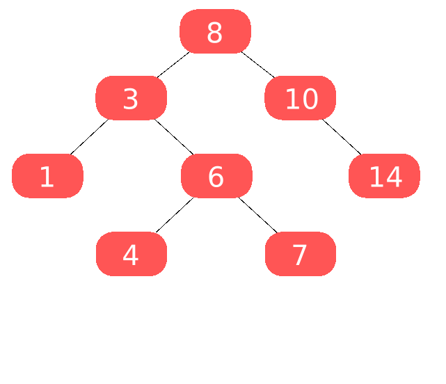
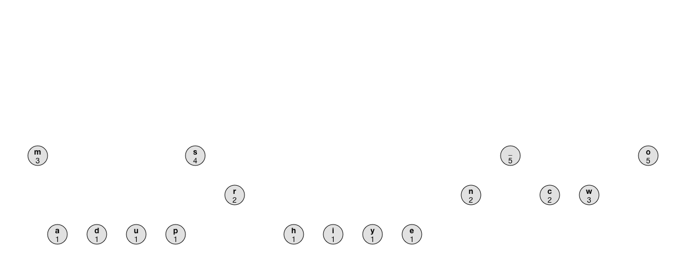

# AVL-HUFFMAN-BINARY
AEDS II | CEFET-MG

<div style="display: inline-block;">    
 
 
</a> 
</div>

<p> </p>
<p> </p>

## Proposta do Projeto

A proposta geral do projeto é criar um sistema que oferece sujestões de palavras relacionadas à partir de uma palavra lida. 
Existe um arquivo com palavras que serão lidas e, caso a palavra trabalhada exista em algum dos arquivos de texto selecionados, é construída uma árvore de cada tipo com as `K` palavras mais recorrentes, com o objetivo de exibir uma sujestão de próxima palavra relacionada.
> São utilizadas árvores AVL, binária e "Código de huffman", que aperfeiçoa a árvore binária.
- É necessário usar uma estrutura `HASH` para o armazenamento das palavras.
  - São consideradas palavras apenas aquelas que possuem todos os caracteres presentes na tabela `ASCII`.
  - Sinais de pontuação são removidos antes da análise de palavras.
- As `N` palavras mais recorrentes são selecionadas utilizando uma estrutura `HEAP`.
- Existe um arquivo chamado `stopwords.csv` que contém palavras consideradas como *stopwords*, elas não devem ser consideradas como palavras à serem analisadas as recorrências. Caso fossem consideradas como palavras comuns, elas iriam ser as que mais apareceriam nos textos.
- Para cada texto em que a palavra trabalhada aparece, é exibido uma árvore de cada tipo no arquivo `output.txt` com as `N` palavras mais recorrentes no texto.

|          Sinais de pontuação  | Stop words                                      |
|-------------------------------|-------------------------------------------------|
| `.`,   `!`,   `?`                   |   `artigos(a, o, as,os), conjunções(e, ou), palavras comuns (aquela, estiver) `  |

## Arquivos e Funções

O projeto é dividido entre três arquivos de códigos própriamente ditos: `leitura.hpp`, `leitura.cpp` e `main.cpp`.
Arquivos de texto auxiliares são utilizados para leitura e escrita.

|  Arquivo                        |   Função                                                                                          |
| ------------------------------- | ------------------------------------------------------------------------------------------------- |
|  `main.cpp`                       | Arquivo principal para iniciar e chamar as funções do código                                                    |
|  `leitura.hpp`                  | Define as funções e as estruturas que foram utilizadas no código |
|  `leitura.cpp`                  | Contém o escopo de todas as funções que foram utilizadas |
| `stopwords.csv` | arquivo que contem as stop words|
| `arquivo_de_leitura.txt` | um dos arquivos de entrada principal no qual será feita toda a análise |
| `input.txt` | arquivo de entrada com as palavras a serem lidas |
| `output.txt` | arquivo de escrita com a exibição das árvores |

> O arquivo `main.cpp` "chama" apenas uma função definida no `leitura.hpp` e processada no `leitura.cpp`, chamada `readPrincipal()`. Ela, por sua vez, organiza todo o processo e as demais funções presentes no projeto. 

## Lógica Implementada

A função `readPrincipal()` trabalha todo o código e invoca as demais funções. 
- Existem duas variáveis do tipo `vector` que "coordenam" qual palavra está sendo trabalhada por qual arquivo:
  - *filenames*: Armazena os arquivos de texto a serem trabalhados
  - *palavras*: Armazena as palavras (`input.txt`) a serem trabalhadas. É preenchido na função `ler_palavras()`.

A função `procurar_no_arquivo()` recebe a palavra trabalhada e o arquivo de texto que será trabalhado, caso ela exista nesse arquivo, é feita a tabela `HASH` separando cada palavra e sua respectiva quantidade de aparições para, posteriormente, ser feita a `heap`, que, por sua vez, separará as *K* palavras mais presentes.

O projeto *WordRecurrence* (repositório) usa a mesma estrutura de alocamento de palavras e suas respectivas quantidades e criação da heap com as palavras mais frequentes que esse repositório.
Para explicações detalhadas sobre funcionamento da HASH e da heap presentes no código, acesse o link: [WordRecurrence](https://github.com/Parreirass/WordRecurrence)

Com a HASH feita e a heap construída, podemos passar para a construção das árvores.
> Cada árvore é feita a partir de um vector (*heap*) de *pair*, em que cada posição armazena a palavra e sua respectiva quantidade de aparições no texto. A inserção e balanceamento são feitos em relação à quantidade de palavras.

A função `calcula_heap()` já faz tanto o processo de criação da heap quanto o de criação de todas as árvores. 
A `ÁRVORE BINÁRIA` é a primeira a ser construída, e ela funciona da seguinte forma:
#### Ávore Binária
- Existe uma função chamada `arvore_binária()`, que cria uma variável de ponteiro do tipo *BinaryNode* apontando para nulo. Depois, percorre posição por posição do vector *min_heap* e vai fazendo a inserção direcionando cada ponteiro para cada filho esquerdo ou direito da posição da árvore da seguinte forma:
  - Caso o próximo valor seja menor, é inserido como filho esquerdo.
  - Caso o próximo valor seja maior, é inserido como filho direito.
  - Caso o próximo valor seja igual, é inserido como filho direito.
``` C++ code
BinaryNode* insertBinaria(BinaryNode* node, int quantidade, const string& palavra) {
    if (node == nullptr) {
        return new BinaryNode(quantidade, palavra);
    }

    if (quantidade < node->quantidade) {
        node->left = insertBinaria(node->left, quantidade, palavra);
    } else if (quantidade > node->quantidade) {
        node->right = insertBinaria(node->right, quantidade, palavra);
    } else {
        node->right = insertBinaria(node->right, quantidade, palavra);
    }

    updateBinaryHeight(node);

    return node;
}
```
- Ao fim da inserção, a função `printInOrderBinary()` imprime a árvore no formato *InOrder* no arquivo `output.txt`.
Finalmente, a função `destroyBinary()` libera a memória alocada para a construção da árvore.
<center>
  
</center>

#### Código de Huffman
A construção de uma árvore de Huffman está diretamente relacionada à construção de uma árvore binária, sendo uma espécie de otimização da mesma, utilizando a concatenação de números `0` e `1`, dependendo da presença de filho esquerdo ou direito.
- Inicialmente, a função `buildHuffmanTree()` cria uma fila de prioridade que encontra os dois *"nós"* menos frequentes mais rapidamente. Para toda posição da `min_heap` é criado um nó *HuffmanNode*
- A cada iteração, os dois nós com as menores frequências são retirados da fila de prioridade.
- Um novo nó é criado como pai desses dois nós, com uma frequência igual à soma das frequências dos filhos.
- O novo nó é inserido de volta na fila de prioridade.
- O processo continua até que haja apenas um nó na fila de prioridade, que se torna a raiz da árvore de Huffman.
> Uma vez que a árvore de Huffman está completa, códigos binários são atribuídos aos símbolos com base na estrutura da árvore. Os caminhos da raiz da árvore até os nós folha determinam os códigos. Aos ramos da esquerda são concatenados o código binário 0, e os ramos da direita são concatenados o código binário 1.

- Como os códigos de Huffman são atribuídos com base na frequência dos símbolos, símbolos mais comuns terão códigos mais curtos e símbolos menos comuns terão códigos mais longos. Isso resulta em uma redução geral no tamanho dos dados, uma vez que os símbolos mais comuns são representados de forma mais eficiente com menos bits.

> Por exemplo, considere um texto que contenha principalmente as palavras "mundo", "planeta", "terra" e "espaço", com a palavra "planeta" sendo a mais comum. Na árvore de Huffman, "planeta" provavelmente terá um código curto, como "10", enquanto as outras palavras terão códigos mais longos, como "110", "111", etc. Quando você compacta o texto usando esses códigos, ele se torna mais curto do que se você usasse a representação completa de cada letra.

<center>
  
</center>

## Conclusão

## Compilação e Execução
Esse exemplo possui um arquivo Makefile que realiza todo o procedimento de compilação e execução. Para tanto, temos as seguintes diretrizes de execução:

| Comando                |  Função                                                                                           |
| -----------------------| ------------------------------------------------------------------------------------------------- |
|  `make clean`          | Apaga a última compilação realizada contida na pasta build                                        |
|  `make`                | Executa a compilação do programa utilizando o gcc, e o resultado vai para a pasta build           |
|  `make run`            | Executa o programa da pasta build após a realização da compilação                                 |

<p> </p>

#### Felipe Parreiras
<div style="display: inline-block;">
<a href="https://t.me/fparreiras">
 
</a>

<a href="https://www.linkedin.com/in/felipe-parreiras-56b075277/">

</a>
